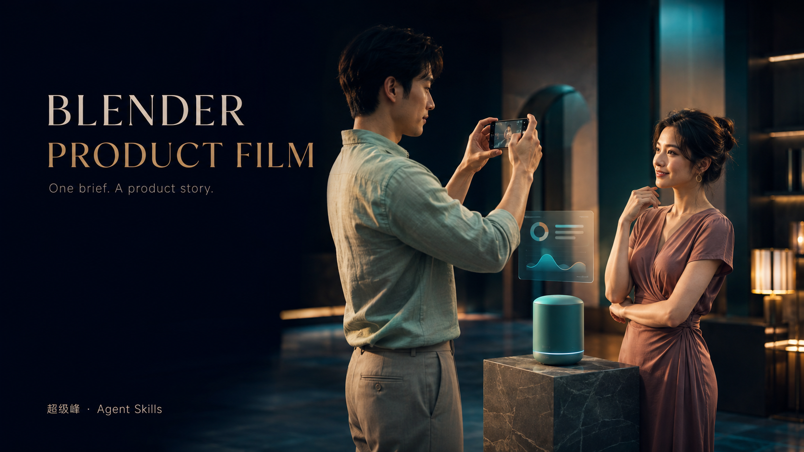
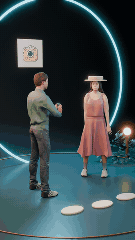
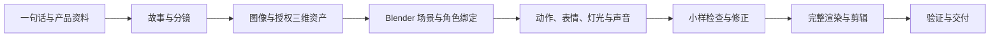

# Blender Product Film · 产品 3D 宣传片

> 给出一句话，结合项目定位，组织从产品故事到可编辑三维场景、动画与成片的制作流程。



[](../LICENSE) [阅读 Skill](../SKILL.md) · [图像来源](ASSETS.md) · [验证范围](VALIDATION.md)

这是超级峰在实际产品宣传片制作过程中整理的 Agent Skill。Agent 根据产品资料组织故事、角色与镜头；配套脚本负责环境准备、资产校验、绑定检查、渲染续作与交付验证。适用于 App、软件服务和实体产品。

## 视频效果

### 人物动画与光影 · 6 秒

展示新版角色的举手机拍照、扶帽、眨眼与面部变化。下方是视频动图预览，点击可查看带声音的原始 MP4。

[](assets/character-animation-6s.mp4)

[查看 / 下载 6 秒视频](assets/character-animation-6s.mp4) · 1080×1920 · 24 fps

### 完整产品故事 · 18 秒

从情侣拍照到照片与品牌收束，展示完整剪辑和配乐。此版采用早期角色造型；新版人物效果见上方 6 秒演示。

[查看 / 下载 18 秒完整故事](assets/product-story-18s.mp4) · 1080×1920 · 24 fps

## 安装与使用

沿用本仓库的安装方式：

```bash
npx skills add mileson/chaojifeng-skills --skill blender-product-film
```

也可以把仓库中的 `blender-product-film` 文件夹交给 Codex，要求安装为本地 Skill。主流程需要能执行本地命令和 Python 的 Agent 环境。内置 ImageGen 依赖宿主提供；本 Skill 不包含生图模型。

在产品项目中输入：

```text
用 $blender-product-film，根据当前项目的核心定位，制作一个展示真实使用场景的 3D 宣传片。
```

可以补充时长、比例、品牌资源或已有 Blender 工程。例如：

- 相机 App：男朋友举手机给女朋友拍照，用自然动作和表情展示拍照时的互动。
- 效率工具：展示一个人从零散信息到完成一件工作，产品功能以项目真实资料为准。
- 智能家居：展示设备在真实房间里的使用过程，突出操作与生活变化。

默认规划为 18 秒、9:16、原生 1080×1920、24 fps；以用户要求与实际渲染资源为准。参考图或试验短片是中间步骤，默认目标是完整成片。

## 包含哪些能力

| 环节 | 工作方式 |
| --- | --- |
| 产品与故事 | 读取现有产品资料，组织问题、产品介入、可见变化和品牌收束 |
| 图像素材 | 用 Codex 内置 ImageGen 制作必要的概念参考和表面纹理；保留原有 Logo |
| 角色 | 使用有来源的三维人体、真实骨架、有效权重和服装蒙皮，按剧情控制面部 |
| 空间与光影 | 在 Blender 中构建场景、相机、灯光、材质，检查阴影、边缘和时间稳定性 |
| 动画与声音 | 组织身体、手部、表情、镜头动作及情境配乐和音效 |
| 执行与交付 | 检查依赖、串行渲染、缓存校验、断点续作、编码和视觉验收 |

ImageGen 输出的是图像，不能代替三维拓扑、骨骼或蒙皮。人物不会默认通过完整 PNG 平面旋转来实现。自然表演和商业美术需要针对镜头迭代，不能只用骨骼数量判断完成。

## 工作流程



Blender 或 bpy 提供三维引擎，FFmpeg 负责基础编码与混音合成。没有环境时，工作流会先探测和复用，再在已授权范围内准备环境。无需为了这个 Skill 重复安装已有软件。

HyperFrames 与 Remotion 是可选后期工具；需要字幕、界面叠加或复杂品牌收尾时按需接入。当前附带脚本直接支持 Blender＋FFmpeg，外部剪辑导出需要补充对应验证，详见 [声音与后期](../references/audio-editing.md)。

## 最终拿到什么

完成并通过检查后，交付 MP4、可编辑 `.blend`、必要素材、来源与许可记录、任务脚本和验证报告。测试片、缺少验收的输出会明确标为 partial。运行时、素材缓存和用户私人资料保留在用户自己的项目中。

## 目录与维护

- `SKILL.md`：Agent 执行入口。
- `references/`：环境、资产、角色、光影、声音与排障说明。
- `scripts/`：环境探测、资产准备、骨架检查、渲染与验证。
- `templates/`：场景合同和视觉检查记录。
- `examples/`：三个产品简报和一个小型三维构建示例。

修改脚本后可运行 `python blender-product-film/scripts/self_test.py` 做轻量检查；真实 Blender 测试另行在任务目录执行。提交问题时请附脱敏错误、系统/Blender 版本与最小复现，不上传凭证或私人项目素材。

## 来源与许可

作者：[超级峰](https://soulcard.me/card/chaojifeng)。本仓库代码与文档沿用 [MIT](../LICENSE)。Blender、MPFB 和下载的模型/音乐/字体等按各自许可证处理，未随 Skill 打包。素材来源记录见 [ASSETS.md](ASSETS.md)。作者署名用于仓库介绍，不自动加入用户生成的视频。
