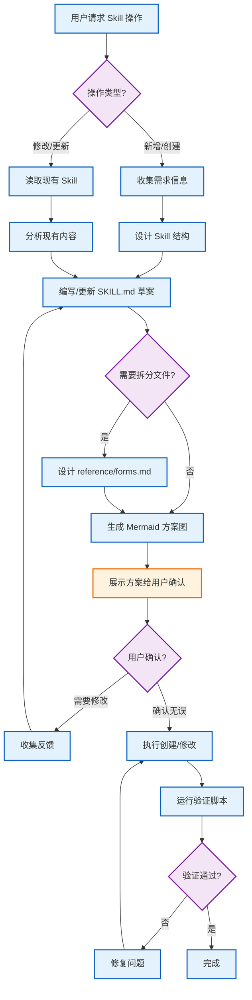
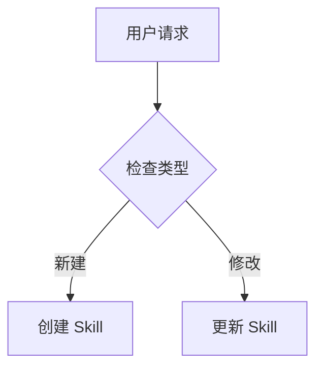
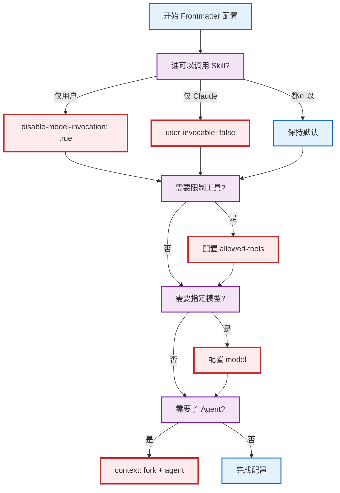

# Skill Creator

> **⚠️ 必须先读**
> 在创建或修改任何 Skill 文件之前，必须先走完下面的 **预创建确认流程**。这不是可选项。在得到用户明确确认之前，不能运行 `init_skill.py`，也不能创建任何文件。

这个 Skill 用来指导如何编写高质量的 Skill。

## 关于 Skill

Skill 是一种模块化、可独立加载的能力包，用来给 Claude 提供特定领域的知识、流程和工具。你可以把它理解成某个任务领域的“上手指南”：它把通用模型变成更擅长特定任务的专用代理。

### Skill 能提供什么

1. 专用流程 - 面向特定领域的多步骤操作
2. 工具集成 - 面向文件格式、API 或外部系统的使用说明
3. 领域知识 - 公司规则、数据结构、业务逻辑
4. 打包资源 - 脚本、示例、模板和参考资料，适合重复任务

## 核心原则

### 简洁优先

上下文窗口是稀缺资源。Skill 会和系统提示、对话历史、其他 Skill 元数据以及用户当前需求共享上下文。

默认前提是：Claude 已经很聪明了。只写 Claude 真的缺的东西。每一段内容都要问自己两次：Claude 真的需要这个解释吗？这段内容值不值它占用的 token？

优先使用简短示例，不要写冗长说明。

### 控制自由度

根据任务的脆弱程度和变化范围，选择合适的约束强度：

- **高自由度（文本型指令）**：适合多种做法都可行、需要结合上下文判断、或主要靠经验规则推进的任务
- **中自由度（伪代码或带参数脚本）**：适合有偏好模式、允许少量变化、或配置会影响行为的任务
- **低自由度（具体脚本、少量参数）**：适合操作脆弱、容易出错、必须按固定顺序执行的任务

可以把 Claude 想成在走路：窄桥要加护栏，开阔地就可以给更多路线。

### Skill 的结构

每个 Skill 都包含一个必需的 `SKILL.md` 文件，以及若干可选的打包资源：

```text
skill-name/
├── SKILL.md           # 主说明文件（必需）
├── template.md        # 供 Claude 填写的模板（可选）
├── data/              # 运行期数据，会跨会话保留（可选）
│   └── memory.md      # 用于重复使用型 Skill 的持久记忆（可选）
├── examples/
│   └── sample.md      # 展示期望输出格式的示例（可选）
├── reference.md       # 详细参考文档（可选）
└── scripts/
    └── helper.py      # 工具脚本，执行时使用，不直接加载进上下文（可选）
```

**官方结构来自** https://code.claude.com/docs/en/skills

#### `SKILL.md`（必需）

每个 `SKILL.md` 由两部分组成：

- **Frontmatter（YAML）**：包含 `name` 和 `description`。Claude 只会读取这两个字段来判断是否触发该 Skill，所以必须写清楚这个 Skill 是什么、在什么场景下应该使用它。
- **正文（Markdown）**：只有在 Skill 触发后才会加载的操作说明与流程指导。

#### 打包资源（可选）

##### Scripts（`scripts/`）

适合放执行型代码（Python / Bash 等），用于需要确定性、反复重写、或容易出错的任务。

- **适合放的时候**：同一段代码反复重写，或者需要稳定、可重复的执行结果
- **示例**：`scripts/rotate_pdf.py`，用于 PDF 旋转
- **好处**：节省 token、结果稳定、可直接执行而不必加载到上下文里
- **注意**：脚本本身有时仍需被读取，以便修补或适配环境差异

##### References（`references/`）

适合放需要按需读取的参考资料和说明文档，用来帮助 Claude 理解任务背景和执行方式。

- **适合放的时候**：需要让 Claude 参考的文档、表结构、公司政策、API 规范、领域知识
- **示例**：`references/finance.md`、`references/mnda.md`、`references/policies.md`、`references/api_docs.md`
- **使用场景**：数据库 schema、API 文档、领域知识、公司政策、详细流程说明
- **好处**：让 `SKILL.md` 保持精简，只在需要时加载对应资料
- **最佳实践**：如果文件超过 10k words，可以在 `SKILL.md` 里加上 grep 搜索提示
- **避免重复**：信息应该只存在于 `SKILL.md` 或 reference 文件其中一处，不要两边都写。除非是核心流程，否则优先把细节放到 reference 文件里，这样 `SKILL.md` 才不会变得臃肿

##### Examples（`examples/`）

适合放示例输出，用来展示预期格式或使用方式。

- **适合放的时候**：需要展示输出格式或标准用法
- **示例**：`examples/sample.md` 用来展示输出格式，`examples/basic-test.js` 用来展示测试写法
- **使用场景**：样例输出、格式模板、使用示例
- **好处**：不用把所有格式细节都塞进上下文

##### Template（`template.md`）

适合放模板文件，供 Claude 填充生成内容。

- **适合放的时候**：Skill 需要生成结构化内容，并且输出格式固定
- **示例**：报告模板、文档模板、PR 描述模板
- **使用场景**：任何需要固定结构的生成任务
- **好处**：输出一致，便于复用

##### 图片资源（OSS / CDN + 本地缓存）

适合放 Skill 需要复用的图片、图标、封面、示例截图、贴纸、视觉素材等二进制资源。

- **默认策略**：源文件放 OSS 或项目指定对象存储，通过图片 CDN URL 下载；Skill 里只保存资源清单、下载/校验脚本和可重建的本地缓存
- **资源清单**：用 `data/assets.yaml` 或同等配置记录资源 ID、CDN URL、本地缓存路径、校验值、来源/授权和刷新策略
- **本地缓存**：把下载后的图片缓存到 `assets/images/`、`assets/cache/` 或项目已约定的缓存目录；执行时先查本地缓存，命中且校验通过就直接使用
- **离线兜底**：网络或 CDN 不可用时，优先使用已校验的本地缓存；缓存缺失时明确说明缺少哪个资源，不要临时伪造或降级成不一致的素材
- **同步脚本**：资源多于 1 个、需要校验、需要重命名或需要格式转换时，优先提供 `scripts/sync_assets.py` 之类的脚本来下载、校验和刷新缓存
- **禁止做法**：不要把大型原始图片、长 Base64 图片、视频、字体等重二进制资源直接塞进 `SKILL.md`、`examples/` 或模板里；极小且不可替代的示例资源例外，但要说明原因

#### 不要放进 Skill 的内容

Skill 里只应该放直接支撑任务的必要内容，不要放多余的辅助文档，比如：

- `README.md`
- `INSTALLATION_GUIDE.md`
- `QUICK_REFERENCE.md`
- `CHANGELOG.md`
- 等等

Skill 应该只包含完成当前任务所需的信息，不要塞入创建过程、安装步骤、测试说明或面向用户的说明文档。额外文档只会增加噪音和混乱。

### 渐进披露设计原则

Skill 使用三级加载机制来控制上下文占用：

1. **元数据（name + description）** - 始终在上下文中（约 100 词）
2. **`SKILL.md` 正文** - 只有在 Skill 触发后加载（少于 5k 词）
3. **打包资源** - 按需加载（脚本可直接执行，不必进上下文，所以基本不受限制）

#### 渐进披露模式

把 `SKILL.md` 正文控制在核心内容范围内，尽量少于 500 行，避免上下文膨胀。接近上限时，把内容拆到单独文件里，并且要在 `SKILL.md` 里明确引用这些文件，告诉读者什么时候该读它们。

**关键原则**：当一个 Skill 支持多种变体、框架或选项时，`SKILL.md` 里只保留核心流程和选择规则，把变体细节、示例和配置移到单独的 reference 文件里。

**模式 1：高层概览 + 参考文件**

```markdown
# PDF 处理

## 快速开始

使用 pdfplumber 提取文本：
[代码示例]

## 高级功能

- **表单填充**：完整指南见 [FORMS.md](FORMS.md)
- **API 参考**：所有方法见 [REFERENCE.md](REFERENCE.md)
- **示例**：常见模式见 [EXAMPLES.md](EXAMPLES.md)
```

Claude 只会在需要时读取 `FORMS.md`、`REFERENCE.md` 或 `EXAMPLES.md`。

**模式 2：按领域组织**

对于覆盖多个领域的 Skill，按主题拆分，避免加载无关内容：

```text
bigquery-skill/
├── SKILL.md（概览和导航）
└── reference/
    ├── finance.md（收入、计费指标）
    ├── sales.md（商机、漏斗）
    ├── product.md（API 用法、功能）
    └── marketing.md（活动、归因）
```

当用户问销售指标时，只读 `sales.md`。

对于支持多种框架或变体的 Skill，也可以按变体组织：

```text
cloud-deploy/
├── SKILL.md（流程 + 云厂商选择）
└── references/
    ├── aws.md（AWS 部署模式）
    ├── gcp.md（GCP 部署模式）
    └── azure.md（Azure 部署模式）
```

当用户选择 AWS 时，只读 `aws.md`。

**模式 3：条件细节**

先给基础内容，再链接到进阶内容：

```markdown
# DOCX 处理

## 创建文档

新建文档时使用 docx-js。详见 [DOCX-JS.md](DOCX-JS.md)。

## 编辑文档

简单编辑时，直接改 XML。

**如需跟踪修订**：见 [REDLINING.md](REDLINING.md)
**如需 OOXML 细节**：见 [OOXML.md](OOXML.md)
```

Claude 只会在需要时读取 `REDLINING.md` 或 `OOXML.md`。

**重要建议：**

- **避免深层嵌套引用** - 参考文件尽量只比 `SKILL.md` 深一层。所有 reference 文件都应该直接从 `SKILL.md` 链接
- **长参考文件要有结构** - 如果参考文件超过 100 行，文件顶部加一个目录，方便 Claude 预览时快速理解范围

---

## 预创建确认流程

在创建或修改任何 Skill 之前，都要按下面的流程走：



### 流程说明

| 阶段 | 动作 | 目的 |
|-------|------|------|
| **需求收集** | 收集和分析需求 | 理解 Skill 的用途和触发场景 |
| **方案设计** | 设计结构并编写草案 | 按最佳实践组织内容 |
| **用户确认** | 展示 Mermaid 方案图 | 确认理解无误后再执行 |
| **执行创建** | 创建或修改文件 | 按已确认的方案落地 |
| **自动验证** | 运行验证脚本 | 确保符合规范 |

### 这个流程什么时候适用

**必须执行：** 只要出现下面任一情况，就要走这套确认流程：

- 用户说“创建 Skill / 新建 Skill / 新增 Skill / 做一个 Skill / 写一个技能”
- 用户说 “create a skill / make a skill / build a skill / write a skill”
- 用户说“修改 Skill / 更新 Skill / update a skill / edit a skill”
- 用户说“添加 Skill / add a skill / 新增功能”
- 用户请求协助创建、修改或重做任何 Agent Skill
- 用户调用 `/skill-creator` 或任何 Skill 创建命令

### 变更图要求

当你要修改或优化一个已有 Skill 时，确认图必须是一张带颜色的 Mermaid 变更提案图，而不是普通流程图。

图中必须区分：

- **灰色 / unchanged**：保持不变的现有流程
- **绿色 / added**：新增的流程、规则、文件或检查点
- **黄色 / changed**：要修改的现有流程
- **红色 / removed / blocked / high-risk**：要删除的内容、阻断路径或高风险操作

默认使用下面这组配色，除非用户提供其他配色：

```mermaid
classDef unchanged fill:#eef2f7,stroke:#94a3b8,color:#0f172a;
classDef added fill:#dcfce7,stroke:#16a34a,color:#14532d;
classDef changed fill:#fef3c7,stroke:#d97706,color:#78350f;
classDef removed fill:#fee2e2,stroke:#dc2626,color:#7f1d1d;
```

在图后面，默认使用“**一句前导总结 + 一张 Markdown 表格**”来说明变更，不再优先使用按颜色分段的大段列表。表格比长列表更容易扫读，也更适合承载多项变更。

**默认表格格式：**

| 状态 | 分类 | 具体内容 |
| --- | --- | --- |
| ⚪️ 不变 | 保持现状 | 写清楚哪些流程、规则、文件或门禁保持不变 |
| 🟡 修改 | 调整现有内容 | 写清楚哪些现有流程、规则或文案会被修改 |
| 🟢 新增 | 新增内容 | 写清楚新增的流程、规则、文件、检查点或说明 |
| 🔴 删除 | 删除 / 阻断 / 高风险 | 写清楚删除项、阻断路径或需要特别提醒的高风险操作 |

**状态映射固定为：**

- ⚪️ = 灰色 / unchanged
- 🟡 = 黄色 / changed
- 🟢 = 绿色 / added
- 🔴 = 红色 / removed / blocked / high-risk

**输出要求：**

1. 表格前先用 1 句话总结这次提案的目标或主要变化
2. 表格里的“具体内容”列直接写可执行、可判断的改动点，不要只写抽象标签
3. 同一状态下如果有多项内容，优先在一个单元格里用短句换行；只有内容很多时再拆成多行
4. 如果用户明确要求先分析，或者明确说先别执行，就不要编辑文件
5. 如果当前任务已经有一张带颜色的 Mermaid 提案图，并且用户已经明确批准，那就直接按已确认内容继续，不要重复确认

**推荐示例：**

| 状态 | 分类 | 具体内容 |
| --- | --- | --- |
| ⚪️ 不变 | 保持现状 | `review-presentation` 校验继续保留<br>`review.html -> review -> change/tasks` 主链路不改 |
| 🟡 修改 | 调整现有流程 | `synthesize` 不再因为派生 `spec.md` 的语言问题而阻断 |
| 🟢 新增 | 新增说明 | Agent 指令里明确“默认简体中文，必要专有名词可保留英文” |
| 🔴 删除 | 删除旧门禁 | 删除 `assertOpenSpecPreflightReady` 这层预检 hard block |

**必须执行的动作：**
1. 先停下，不要运行 `init_skill.py`
2. 先走完整个确认流程
3. 用 `render_mermaid.py` 把 Mermaid 图渲染成 PNG
4. 把图展示给用户
5. **等待用户明确批准** 后再继续
6. 只有用户批准后，才能执行创建步骤

**违规说明：** 跳过用户确认，直接运行 `init_skill.py`，属于严重错误。

#### Mermaid 图渲染

> **环境自适应规则**：展示 Mermaid 图之前，先判断当前环境，然后选择对应的渲染方式。

**环境判断方法：**

| 判断条件 | 环境类型 | 渲染方式 |
|----------|----------|----------|
| 系统提示里包含 `"You operate in Cursor"`，或存在 IDE 上下文（例如 open files、workspace 等） | IDE 环境（Cursor / VS Code 等） | 直接输出 ` ```mermaid ` 代码块 |
| 上述条件都不满足（纯终端 / CLI，例如 Claude Code） | CLI 环境 | 调用 `render_mermaid.py` 生成 PNG |

##### 路径 A：IDE 环境（Cursor / VS Code 等）

IDE 原生支持 Mermaid 渲染，直接在回复里输出 Mermaid 代码块就可以，不用调用外部脚本：

````markdown

````

- 不需要网络请求，也不依赖外部工具
- IDE 聊天界面会自动渲染成可视化流程图
- 不要调用 `render_mermaid.py`，避免生成多余的 PNG 文件

##### 路径 B：CLI 环境（Claude Code 等）

终端不能直接渲染 Mermaid 语法时，使用脚本生成 PNG 图片：

**阶段 1 - 用户确认（预览）**

当 Skill 目录还不存在时（也就是确认流程阶段）：

```bash
# 先把 SKILL_CREATOR_DIR 替换为你本地的 skill-creator 目录
SKILL_CREATOR_DIR=./skill-creator

# 必须提供 --skill-desc 参数
# 根据当前讨论的 skill 生成一句话描述（3-8 个字，简洁明了）
python3 "$SKILL_CREATOR_DIR/scripts/render_mermaid.py" \
  -c "graph TB; A-->B" \
  --skill-desc "新闻资讯总结"

# 生成的文件名示例: skill-新闻资讯总结_001.png
# 再次运行时会自动递增: skill-新闻资讯总结_002.png

# 也可以从文件读取
python3 "$SKILL_CREATOR_DIR/scripts/render_mermaid.py" \
  -f <path-to-mermaid-file> \
  --skill-desc "API接口生成"
```

**阶段 2 - Skill 创建完成后（文档化）**

只有在 Skill 目录已经存在之后，才可以输出到 Skill 文件夹里：

```bash
# 输出到已创建的 Skill 文件夹中，作为文档
python3 "$SKILL_CREATOR_DIR/scripts/render_mermaid.py" \
  -c "graph TB; A-->B" \
  --skill-desc "数据库迁移" \
  -o <target-skill-dir>/workflow-diagram.png
```

**CLI 渲染参数说明：**
- `--skill-desc`（**必填**）：Skill 的简短中文描述（3-8 个字），用于生成有语义的文件名
- `-o`：指定输出路径（可选，默认输出到 `mermaid-imgs/`）
- `--no-open`：不自动打开预览（可选）
- 文件名格式：`skill-{描述}_{序号}.png`（自动递增）
- 依赖：需要网络连接（使用 Kroki API）
- 默认输出到本地 `mermaid-imgs/` 预览目录；这些预览图是临时产物，不要提交到公开仓库或正式版本控制中

#### Mermaid 语言规范

编写 Mermaid 流程图时，遵循下面的语言规范：

- **优先使用中文**：除了必要的技术术语外，所有节点和描述都应该用中文
- **技术术语保持英文**：例如 API、HTTP、JSON 等专业术语可以保留英文
- **示例**：
  ```mermaid
  graph TB
      A[用户请求] --> B{检查权限}
      B -->|授权| C[调用 API]
      B -->|拒绝| D[返回错误]
  ```

---

## Skill 创建流程

Skill 创建分为下面几步：

1. 结合具体示例理解这个 Skill
2. 规划可复用的 Skill 内容（scripts、references、examples、templates）
3. 初始化 Skill（运行 `init_skill.py`）
4. 编辑 Skill（实现资源并编写 `SKILL.md`）
5. 根据真实使用情况继续迭代

按顺序执行，只有在明确不适用时才跳过。

### 第 1 步：结合具体示例理解 Skill

只有在这个 Skill 的使用模式已经非常明确时，才可以跳过这一步。即使是在处理已有 Skill 的时候，这一步也很有价值。

要做出有效的 Skill，必须先搞清楚它会被怎么用。这个理解可以来自用户给出的示例，也可以来自你先生成示例，再通过用户反馈验证。

比如在做一个 image-editor Skill 时，可以问：

- 这个 image-editor Skill 应该支持什么功能？编辑、旋转，还是别的？
- 你能给我几个使用这个 Skill 的例子吗？
- 我能想象用户会说“去掉这张图里的红眼”或者“把这张图转一下”。还有别的用法吗？
- 用户会怎么说，才应该触发这个 Skill？

为了不把用户淹没在问题里，一次只问最重要的问题，后面再继续追问。

当你已经清楚这个 Skill 应该支持什么功能时，就可以结束这一步。

### 第 2 步：规划可复用的 Skill 内容

要把具体示例转成有效的 Skill，可以按下面的方法分析每个示例：

1. 想一想如果从头执行这个示例，要怎么做
2. 找出哪些 scripts、references、examples 和 templates 适合沉淀下来，方便重复使用

例子：如果在做一个 `pdf-editor` Skill，用户常说“帮我旋转这个 PDF”，分析结果可能是：

1. 每次旋转 PDF 都要重复写同样的代码
2. 把 `scripts/rotate_pdf.py` 存进 Skill 会很有帮助

例子：如果在做一个 `frontend-webapp-builder` Skill，用户常说“帮我做一个 todo app”或者“帮我做一个步数看板”，分析结果可能是：

1. 每次写前端 Web 应用都要重复写同样的 HTML / React 样板
2. 放一个 `template.html` 文件，或者放一个带样板代码的 `examples/` 目录，会很有帮助

例子：如果在做一个 `big-query` Skill，用户常说“今天有多少用户登录了”，分析结果可能是：

1. 每次查询 BigQuery 都要重新找表结构和关系
2. 把表结构写进 `references/schema.md`，会很有帮助

要确定 Skill 的内容，就要把每个具体示例拆解一遍，整理出应该加入的可复用资源：scripts、references、examples、templates。

#### 图片资源决策

如果 Skill 需要图片、图标、封面、示例截图、贴纸、视觉素材或其他二进制资源，默认按“远端源文件 + CDN 下载 + 本地缓存 + 离线兜底”设计：

1. 把源文件放到 OSS 或项目指定对象存储，不把大型图片直接打包进 Skill
2. 通过图片 CDN URL 作为标准下载入口
3. 在 `data/assets.yaml` 或同等配置里记录 CDN URL、本地路径、校验值、来源/授权和刷新策略
4. 把下载后的文件缓存到 `assets/images/`、`assets/cache/` 或项目已有缓存目录
5. 执行时先使用本地缓存；只有缓存缺失、校验失败或用户要求刷新时才访问 CDN
6. CDN 不可用但本地缓存可用时继续执行；缓存也不可用时，说明缺少资源并请求补齐或授权上传

如果当前任务还没有 OSS/CDN 地址，就先把资源清单字段和缓存路径设计好，并标记“待上传/待配置”，不要把临时本地图片伪装成长期规范。

#### 持久记忆决策

判断这个 Skill 是会长期重复使用（persistent-use），还是一次性任务（one-off）：

- **长期复用型 Skill**（例如 content-creator、deployment-pipeline、training-framework）：添加 `data/memory.md` 文件，并在 `SKILL.md` 里写清楚读写记忆的规则。这样这个 Skill 就能持续积累经验、记录用户偏好，并逐步变强
- **一次性 Skill**（例如 pdf-rotate、image-resize）：不要加 memory。每次执行都视为独立任务

**持久记忆模式**：格式规范、读写规则和容量管理，请参考 [references/persistent-memory.md](references/persistent-memory.md)

#### 配置文件决策

如果这个流程需要可复用的配置项、阈值、映射、环境变量，或者其他会随场景变化的参数，就创建一个 `data/*.yaml` 文件来保存当前有效配置。

- 如果不确定某个值应该放到 YAML 里还是直接写在正文里，就先用 `AskUserQuestion` 问用户一个聚焦的问题，再决定
- YAML 里只放当前生效的值、字段说明和使用提示
- 不要在 YAML 里记录变更历史
- 让 `SKILL.md` 说明这个文件什么时候读、怎么用
- 文件名尽量写得具体一些，通常用 `data/config.yaml`，除非这个 Skill 需要多个配置域

### 第 2.5 步：配置 Frontmatter（关键）

> **⚠️ 强制检查点**
> 在运行 `init_skill.py` 之前，必须先确定 frontmatter 配置。
>
> **不要跳过这一步。** frontmatter 配置不对，可能导致：
> - Skill 触发不到
> - Skill 触发太频繁
> - 执行上下文不对（inline 或 subagent）
> - 工具权限不足

**Frontmatter 决策流程：**



**决策问题：**

| 问题 | 选项 | Frontmatter 字段 | 值 |
|------|------|------------------|----|
| 谁可以调用？ | 仅用户 / 仅 Claude / 都可以 | `disable-model-invocation` / `user-invocable` | 见下表 |
| 需要限制工具？ | 是 / 否 | `allowed-tools` | `["Bash", "Read"]` 等 |
| 需要指定模型？ | 是 / 否 | `model` | `sonnet` / `opus` / `haiku` |
| 需要子 Agent？ | 是 / 否 | `context` + `agent` | `fork` + `Explore` 等 |

**调用模式配置表：**

| 模式 | 配置 | 用户调用 | Claude 自动调用 |
|------|------|----------|-----------------|
| 默认模式 | （无配置） | ✓ | ✓ |
| 用户独占 | `disable-model-invocation: true` | ✓ | ✗ |
| Claude 独占 | `user-invocable: false` | ✗ | ✓ |

**完整说明**：所有可用字段、详细解释和示例，请看 [frontmatter.md](references/frontmatter.md)

> **重要**：在确定好需要的 frontmatter 字段之后，要把它们写进展示给用户确认的 Mermaid 提案图里。

### 第 3 步：初始化 Skill

> **⚠️ 关键检查点**
> **先停下。** 在运行 `init_skill.py` 之前，必须先满足下面三条：
> 1. 已完成上面的预创建确认流程
> 2. 已经把 Mermaid 图渲染并展示给用户
> 3. 已经拿到用户的**明确批准**
>
> **如果用户还没有批准，就不要继续。** 回到确认流程。

这时才可以真正创建 Skill。

只有在要创建新 Skill 时，才需要运行 `init_skill.py`。如果这个 Skill 已经存在，只是在迭代或打包，那就跳到下一步。

从零创建 Skill 时，始终运行 `init_skill.py`。这个脚本会生成一个包含必要内容的模板目录，让创建流程更高效、更可靠。

用法：

```bash
scripts/init_skill.py <skill-name> --path <output-directory>
```

脚本会：

- 创建指定路径下的 Skill 目录
- 生成带有正确 frontmatter 和 TODO 占位符的 `SKILL.md` 模板
- 创建示例资源目录：`scripts/` 和 `examples/`
- 在每个目录里放入可自定义或删除的示例文件

初始化完成后，再按需要定制或删除生成出来的 `SKILL.md` 和示例文件。

### 第 4 步：编辑 Skill

在编辑新生成的或已有的 Skill 时，要记住这个 Skill 是写给另一位 Claude 用的。要把对它真正有帮助、但又不那么显眼的流程知识、领域细节和可复用资源写进去。

#### 先了解成熟模式

按需参考下面这些指南：

- **多步骤流程**：看 [references/workflows.md](references/workflows.md)，里面有顺序流程和条件逻辑
- **特定输出格式或质量标准**：看 [references/output-patterns.md](references/output-patterns.md)，里面有模板和示例模式

这些文件里已经整理了有效的 Skill 设计方法。

#### 先从可复用内容开始

实现时，先从前面分析出来的可复用资源入手：`scripts/`、`references/`、`examples/` 和 `template.md`。

注意，这一步有时需要用户输入。比如在做 `brand-guidelines` Skill 时，用户可能需要提供品牌素材或模板。

如果包含图片资源，先落地资源清单、缓存目录和同步脚本，再写正文引用方式。至少检查一次“联网下载成功”和“断网或 CDN 不可用时命中本地缓存”的路径；需要 OSS 上传凭证时，只使用用户授权的密钥来源，不要把完整密钥写进 Skill、日志或示例。

新增的脚本必须实际运行测试，确认没有 bug，而且输出符合预期。如果脚本很多，至少抽一部分代表性脚本测试，既保证信心，也不浪费时间。

不需要的示例文件和目录要删除。初始化脚本会创建 `scripts/` 和 `examples/` 里的演示文件，但大多数 Skill 都不需要全部保留。

#### 更新 `SKILL.md`

**写作规范：** 始终使用祈使式或不定式表达。

**语言规范：** 用这个 Skill 创建或更新的所有 Skill，都必须默认使用简体中文表达。不要按文件来区分语言，而要按内容来判断：只有专有术语、字段名、路径、命令、代码标识、API 名称、库名、模型名等必要内容可以保留英文；除此之外，frontmatter 的字段值、正文、表格、示例说明、流程图节点、模板说明和提示语都应该使用简体中文。

##### Frontmatter

YAML frontmatter 只写 `name` 和 `description`：

- `name`：Skill 名称
- `description`：这是主要触发条件，帮助 Claude 判断什么时候该用这个 Skill。
  - `description` 是字段名，可以保留英文；它的内容默认必须用简体中文写
  - 这里要同时写清楚这个 Skill 是做什么的，以及在什么场景下应该用它
  - 所有“什么时候使用”的信息都写在这里，不要放到正文里。正文只有在触发后才会加载，所以“何时使用”这种段落对 Claude 没有帮助
  - 例如 `docx` Skill 的 description 可以写成：“面向专业文档（.docx）的创建、编辑和分析，支持修订跟踪、评论、格式保留和文本提取；当 Claude 需要处理 .docx 文件时使用，例如：1. 新建文档 2. 修改内容 3. 处理修订 4. 添加评论 或其他文档任务”

YAML frontmatter 不要包含其他字段。

**可选的 Frontmatter 字段**：除了 `name` 和 `description` 之外，还有一些可选字段，比如 `disable-model-invocation`、`allowed-tools`、`context` 等。

> 更完整的配置说明和决策流程图，请参考 [frontmatter.md](references/frontmatter.md)

##### 正文

写清楚如何使用这个 Skill，以及如何使用它打包的资源。

生成或更新正文时，先检查所有自然语言内容是否已经按上面的语言规范改为简体中文。不要因为文件名是 `SKILL.md`、示例文件或模板文件，就保留大段英文说明；只有内容本身属于必要英文时才保留。

### 第 5 步：迭代

测试过 Skill 之后，用户往往会提出改进需求。这个时候通常离真实使用很近，最容易看出这个 Skill 哪里卡住了。

**迭代流程：**

1. 先把 Skill 用在真实任务上
2. 注意哪里别扭、低效或容易出错
3. 找出 `SKILL.md` 或打包资源应该怎么改
4. 改完之后再测试一轮
